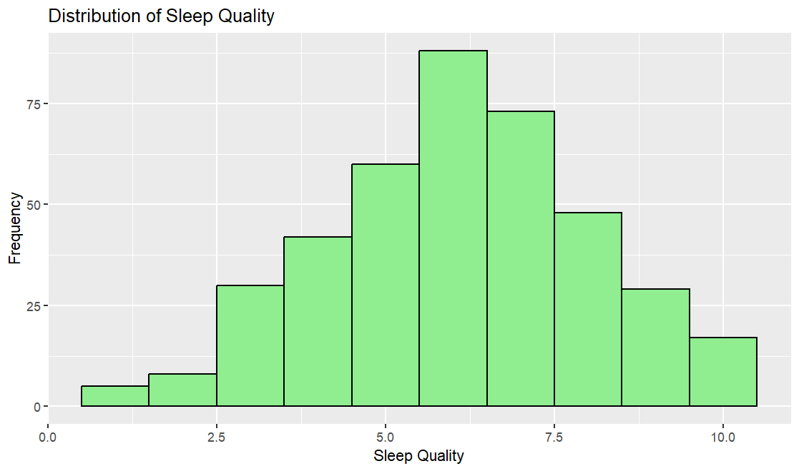
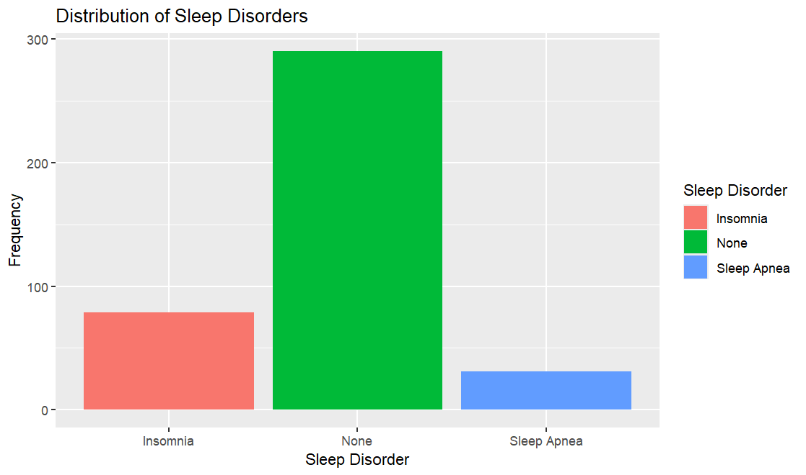
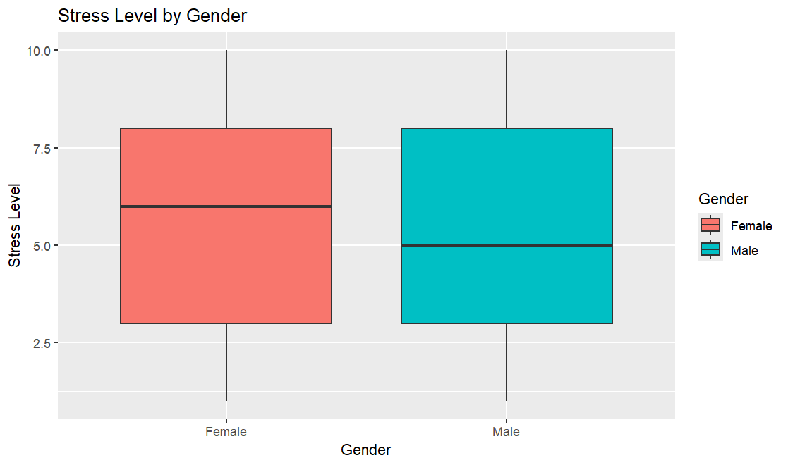
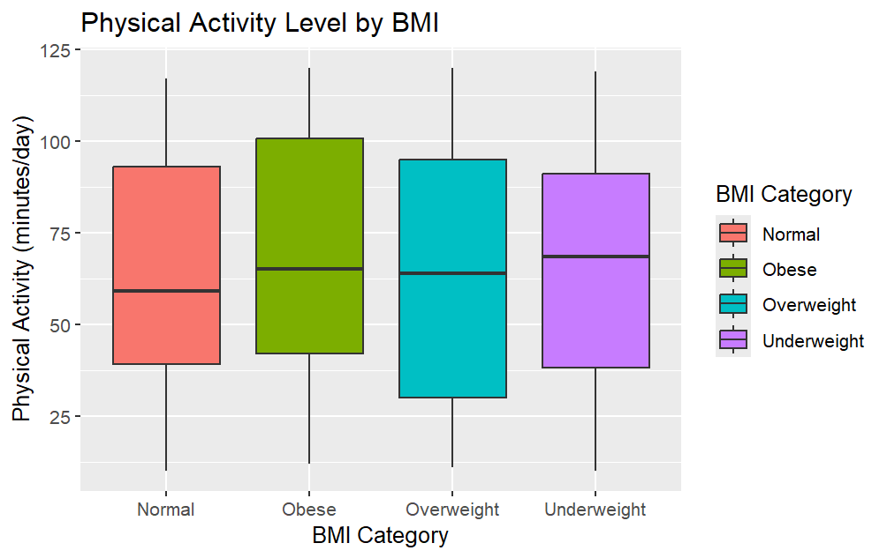
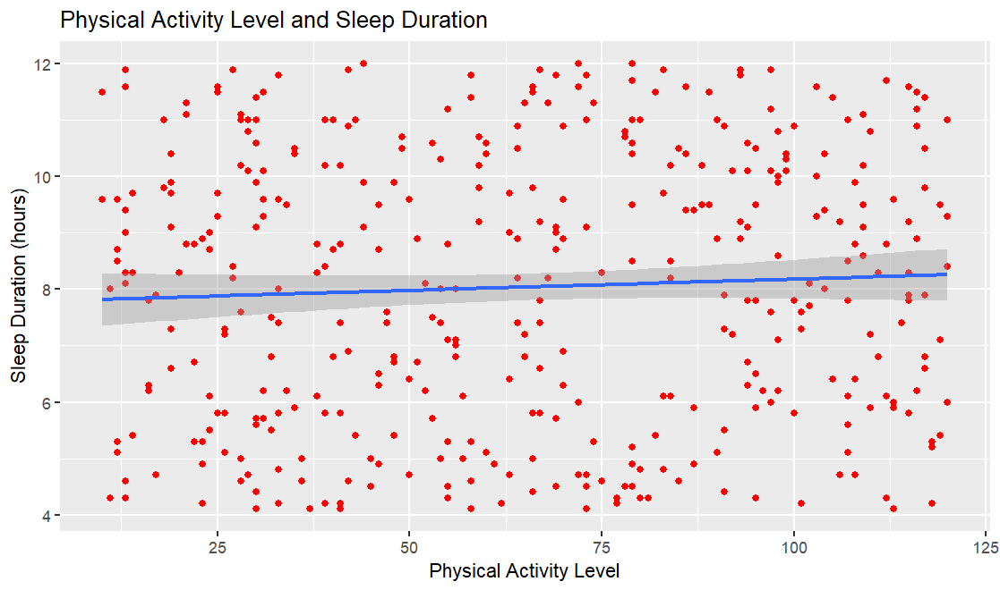

# Sleep Health & Lifestyle Analysis 😴📊

An exploratory data analysis (EDA) project in R examining the relationships between sleep, stress, physical activity, and various lifestyle factors.

## 🎯 Project Objective
Using the Sleep Health & Lifestyle dataset to explore how sleep quality and duration relate to factors such as age, occupation, stress level, physical activity, and BMI.

## 🛠️ Tools & Libraries Used
- **R**
- `readxl` — for loading Excel data
- `ggplot2` — for data visualization

## 📈 Analysis Steps
1. **Data Exploration** — checking dimensions, structure, and missing values
2. **Descriptive Statistics** — calculating Mean, Median, and SD for Sleep Duration, Sleep Quality, Stress Level, and Physical Activity
3. **Group-wise Summaries** — average Sleep Duration by Occupation, average Daily Steps by Gender
4. **Correlation Analysis** — Age vs Sleep Quality, Stress vs Sleep Quality, Physical Activity vs Sleep Duration, Daily Steps vs Sleep Duration
5. **Data Visualization** — histograms, bar charts, boxplots, and scatter plots

## 📊 Results

**Descriptive Statistics (Table1)**

| Variable | Mean | Median | SD |
|---|---|---|---|
| Sleep Duration | 8.04 | 8.2 | 2.39 |
| Sleep Quality | 6.13 | 6.1 | 1.98 |
| Stress Level | 5.47 | 5.0 | 2.81 |
| Physical Activity | 64.99 | 65.5 | 32.30 |

**Correlation Analysis (Table2)**

| Variables | Correlation |
|---|---|
| Age vs Sleep Quality | -0.011 |
| Stress vs Sleep Quality | -0.015 |
| Physical Activity vs Sleep Duration | 0.054 |
| Daily Steps vs Sleep Duration | -0.055 |

All correlation coefficients are close to zero, indicating no meaningful linear relationship between these variables and sleep quality/duration in this dataset.

**Average Daily Steps by Gender**

| Gender | Daily Steps |
|---|---|
| Female | 11311.54 |
| Male | 10839.12 |

## 📉 Visualizations

**Distribution of Sleep Quality**



**Distribution of Sleep Disorders**



**Stress Level by Gender**



**Physical Activity Level by BMI Category**



**Physical Activity Level vs Sleep Duration**



## 📂 Files
- `sleep_health_factors.R` — full analysis code
- `plots/` — folder containing all generated graphs

## 🚀 How to Run
1. Install R and RStudio
2. Install the required packages:
```r
   install.packages(c("readxl", "ggplot2"))
```
3. Place the dataset file in the same folder and make sure the filename matches the one in `read_excel()`
4. Run the script line by line

## 📌 Note
The original code contains a hardcoded local path (`setwd("D:/R")`), which should be updated to match your own machine's folder structure.

